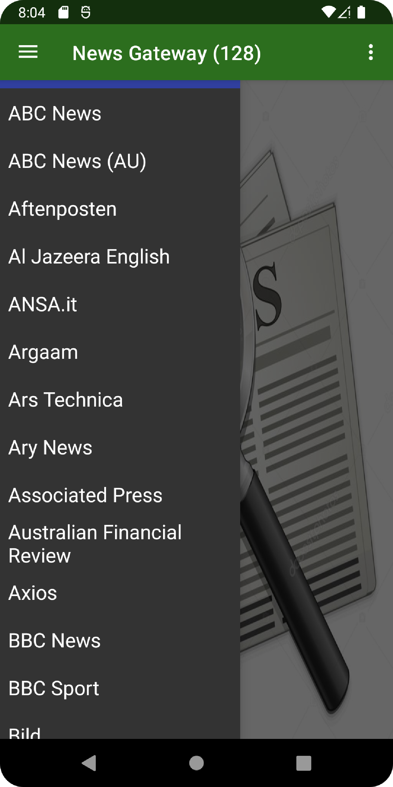
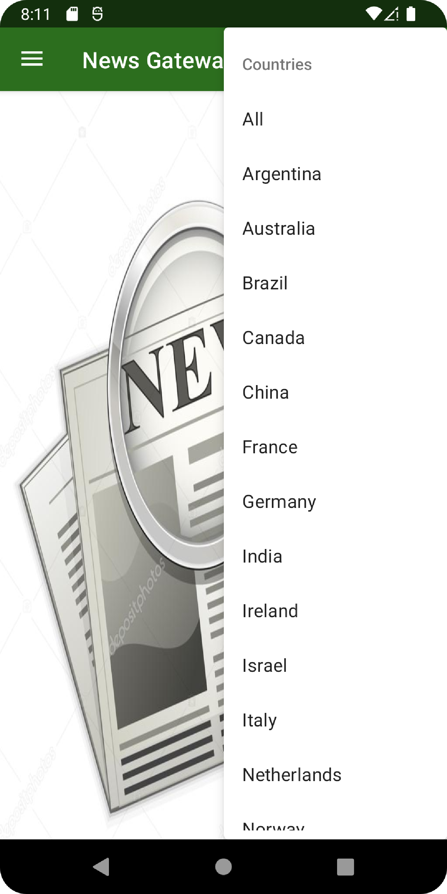

# News Aggregator App

This applicaiton was developed via Android Studio and uses Java. 
The app's general purpose is to display news articles from a variety of different
news publications. 

The app's main feature is the ability to click on up to three menu options
and gets the list of the publications which fulfill the selected categories.

### News Publications

The app uses the Api at [link](https://newsapi.org/). The api 
provides news articles from 128 different publications. When a news source is clicked
on the top ten news articles from that publication are shows to the user. 

   

### Menu Selections

The app has three menu options the client can select. These menu options are designed to narrow the categories of news publications that will be listed. The menu options include selecting based on the cateogry, the country origin, and the language for the publications. There are also "All" selections in each of the menu selections which act as an undo selector of sorts.

The menu selections are combined to get a final list of news publications that fulfill the combination. For example selecting "Business-United States-English" gives the client a list of news publications of the business category in the United States written in English. Selecting "Business-All-English" gives business publications from all countries that are written in English. 

   

### Additional Features and Android Studio Features Used

Once a publication is selected the user can swipe left and right to preview up to ten articles from the given publication. Clicking on the picture or the title of the preview takes the client to the actual article in the browser. 

The overall list of programming features the app utilizes are: Drawer Layouts, ViewPager2, Adapters, APIs, Dynamic Menus, and Implied Intents.

